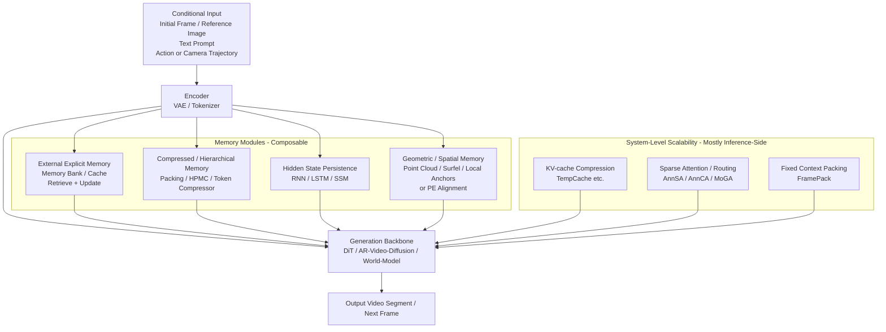

<div align="center">

# Awesome World Models with Memory

[](https://github.com/sindresorhus/awesome) [](LICENSE.txt) [](CONTRIBUTING.md)

**A Curated List of Memory-Augmented World Models for Video Generation, focusing on how memory mechanisms enable long-horizon consistency, revisit fidelity, and scalable interactive generation.**

</div>

---

## News & Updates

**[2026-02] Repository Launch** -- Awesome World Models with Memory is now live! A curated collection of memory-augmented world models spanning external memory banks, hierarchical compression, geometric spatial memory, and more. See [CONTRIBUTING.md](CONTRIBUTING.md) for how to contribute.

**[Ongoing] Community Contributions Welcome** -- Help us maintain the most up-to-date resource on memory mechanisms in world models! Submit papers via PR.

---

## Overview

- [Awesome World Models with Memory](#awesome-world-models-with-memory)
  - [News \& Updates](#news--updates)
  - [Overview](#overview)
  - [Aim of the Project](#aim-of-the-project)
  - [Background \& Motivation](#background--motivation)
  - [External Explicit Memory Modules](#external-explicit-memory-modules)
  - [Memory Compression \& Retrieval Mechanisms](#memory-compression--retrieval-mechanisms)
  - [Differentiable Neural Storage \& Hidden State Enhancement](#differentiable-neural-storage--hidden-state-enhancement)
  - [Attention / Transformer Extensions](#attention--transformer-extensions)
  - [Geometric / Spatial Memory](#geometric--spatial-memory)
  - [Training Stability \& Anti-drift Strategies](#training-stability--anti-drift-strategies)
  - [Benchmarks \& Evaluation](#benchmarks--evaluation)
  - [Open-source Systems](#open-source-systems)
  - [Related World Model Lists](#related-world-model-lists)
  - [Citation](#citation)

---

## Aim of the Project

Over the past two years, video generation has been increasingly "world-model-ized": models must not only generate short clips, but also maintain consistency over long horizons, interactive control (action/camera), and revisiting the same locations (revisit/loop closure). Almost all of these capabilities directly rely on **memory design**.

A large body of 2025-2026 work decomposes the "memory problem" into two categories:

- **Representation-level memory**: How to persistently store world state (hidden states / explicit external memory / geometric maps / compressed tokens).
- **System-level memory**: How to retain sufficient history within compute and memory budgets (KV-cache, sparse attention, context packing & retrieval).

This repository aims to:

- **Organize** the rapidly growing body of memory-augmented world model research by mechanism type
- **Provide** a clear taxonomy of seven memory mechanism categories for navigating the design space
- **Track** the latest developments in long-horizon consistency, revisit fidelity, and scalable interactive generation
- **Bridge** the gap between different memory approaches (explicit vs. implicit, geometric vs. learned, compression vs. retrieval)

---

## Background & Motivation

The "memory problem" in video-generative world models can be summarized as four core tensions:

1. **Long-term consistency vs. compute/memory linear growth** -- Maintaining coherence over thousands of frames without blowing up attention costs.
2. **Controllability (action/camera) vs. memory noise & drift** -- Injecting actions while preventing accumulated errors from corrupting stored states.
3. **Explicit geometric memory's strong consistency vs. pose/depth error propagation** -- 3D structures offer strong spatial grounding but amplify estimation noise.
4. **Training-inference distribution mismatch causing long-rollout error accumulation** -- Autoregressive rollouts drift from the training distribution over time.

The overall trend is: memory mechanisms are shifting from "stuff more frames into context" toward a combined approach of **retrieval + compression + alignment (geometric or positional encoding) + training stabilization**.

### Unified Architecture Overview



---

## External Explicit Memory Modules

*Entity/shot/segment-level Memory Bank, with on-demand retrieval and update (narrative, multi-shot, multi-round editing).*

- [**2026**] **VideoMemory**, "VideoMemory: Toward Consistent Video Generation via Memory Integration". [](https://arxiv.org/abs/2601.03655) [](https://hit-perfect.github.io/VideoMemory/)
  > Entity-centric Dynamic Memory Bank (character/prop/background slots), shot-level "retrieve-update", combined with multi-agent script decomposition to shots and keyframe+video generation. DINOv2 similarity metrics show significantly better character/prop/background consistency across 4/8/12 shots vs. baselines.

- [**2026**] **Memory-V2V**, "Memory-V2V: Augmenting Video-to-Video Diffusion Models with Memory". [](https://arxiv.org/abs/2601.16296) [](https://dohunlee1.github.io/MemoryV2V/) [](https://github.com/DoHunLee1/Memory-V2V)
  > External cache memory for multi-round video editing: retrieval (VideoFOV overlap / source similarity) + dynamic tokenization + learnable token compressor. Adaptive token merging achieves >30% FLOPs and runtime reduction without quality degradation.

- [**2025**] **OneStory**, "OneStory: Coherent Multi-Shot Video Generation with Adaptive Memory". [](https://arxiv.org/abs/2512.07802) [](https://zhaochongan.github.io/projects/OneStory/)
  > Reformulates multi-shot generation as next-shot prediction; Frame Selection builds semantically-relevant global memory; Adaptive Conditioner does importance-guided patch compression and direct injection.

- [**2025**] **Context as Memory**, "Context as Memory: Scene-Consistent Interactive Long Video Generation with Memory Retrieval". [](https://arxiv.org/abs/2506.03141) [](https://context-as-memory.github.io/)
  > Directly stores history frames as memory and concatenates at input dimension; Memory Retrieval uses camera FOV overlap to filter relevant frames, reducing computational explosion. Claims SOTA memory capability on interactive long video with open-domain generalization.

- [**2025**] **VMem**, "VMem: Surfel Memory of Views". [](https://arxiv.org/abs/2506.18903) [](https://github.com/runjiali-rl/vmem)
  > Surfel-indexed view memory, anchoring historical views to surface elements for improved long-term consistency.

- [**2025**] **WorldMem**, "WorldMem: Long-term Consistent World Simulation with Memory". [](https://arxiv.org/abs/2504.12369)
  > Explicitly targets "memory-augmented long-term world simulation consistency" for revisit tasks.

- [**2025**] **VRAG**, "Learning World Models for Interactive Video Generation". [](https://arxiv.org/abs/2505.21996)
  > Focuses on interactive video world model barriers and evaluation frameworks, with a "retrieval-augmented" approach (VRAG).

- [**2025**] **Video World Models with Long-term Spatial Memory**. [](https://arxiv.org/abs/2506.05284)
  > Focuses on "long-term spatial memory" in video world models for spatial consistency and revisit tasks.

---

## Memory Compression & Retrieval Mechanisms

*Compress infinite history into a fixed budget (packing, summarization, hierarchical compression), or activate only "relevant memory" in attention.*

- [**2026**] [**Infinite-World**] **Infinite-World**, "Infinite-World: Scaling Interactive World Models to 1000-Frame Horizons via Pose-Free Hierarchical Memory". [](https://arxiv.org/abs/2602.02393) [](https://rq-wu.github.io/projects/infinite-world/index.html) [](https://github.com/MeiGen-AI/Infinite-World)
  > Hierarchical Pose-free Memory Compressor (HPMC) recursively compresses history latents to a fixed budget; combined with uncertainty-aware action annotation and revisit-dense finetune to activate loop-closure. Reports higher ELO scores in user studies and strong VBench metrics. Open-source code + weights.

- [**2025**] **MemFlow**, "MemFlow: Flowing Adaptive Memory for Consistent and Efficient Long Video Narratives". [](https://arxiv.org/abs/2512.14699) [](https://github.com/KlingTeam/MemFlow)
  > Narrative Adaptive Memory: retrieves and updates memory bank by current paragraph prompt; Sparse Memory Activation: activates only the most relevant memory tokens in attention, balancing efficiency. Only ~7.9% speed overhead vs. memory-free baseline while significantly improving consistency.

- [**2025**] **WorldPack**, "WorldPack: Compressed Memory Improves Spatial Consistency in Video World Modeling". [](https://arxiv.org/abs/2512.02473)
  > Compressed memory via trajectory packing (improving context efficiency) + memory retrieval (maintaining long rollout consistency and spatial reasoning). Significantly outperforms strong baselines on LoopNav benchmark.

- [**2025**] **Pack and Force Your Memory**, "Pack and Force Your Memory: Long-form and Consistent Video Generation". [](https://arxiv.org/abs/2510.01784)
  > MemoryPack: learnable context retrieval (combining text and image global guidance) for short/long dependencies; Direct Forcing: single-step approximation to improve training-inference alignment and mitigate error accumulation.

- [**2025**] **LoViC**, "LoViC: Efficient Long Video Generation with Context Compression". [](https://arxiv.org/abs/2507.12952)
  > FlexFormer: jointly compresses video and text into a unified latent, supporting adjustable compression rates and long video segment-wise generation.

---

## Differentiable Neural Storage & Hidden State Enhancement

*RNN/LSTM, SSM, recurrent states and other persistent internal states (often combined with local attention).*

- [**2026**] **Flow Equivariant World Models**, "Flow Equivariant World Models: Memory for Partially Observed Dynamic Environments". [](https://arxiv.org/abs/2601.01075) [](https://flowequivariantworldmodels.github.io/) [](https://flowequivariantworldmodels.github.io/)
  > Unifies ego-motion and object motion as Lie group flows, building equivariant latent memory map; maintains stable world state in partially observable environments.

- [**2025**] **RELIC**, "RELIC: Interactive Video World Model with Long-Horizon Memory". [](https://arxiv.org/abs/2512.04040) [](https://relic-worldmodel.github.io/)
  > Highly compressed history latent tokens (with relative actions and absolute camera poses) as long-term memory in KV cache; self-distillation/self-forcing converts bidirectional teacher to causal student. 14B model achieves 16 FPS with superior action-following and spatial memory retrieval.

- [**2025**] **VideoSSM**, "VideoSSM: Autoregressive Long Video Generation with Hybrid State-Space Memory". [](https://arxiv.org/abs/2512.04519)
  > Hybrid memory: sliding-window local lossless cache (short memory) + SSM compressed global state (long memory), treating generation as a recurrent dynamical system updating compressed states.

- [**2025**] **RAD**, "Recurrent Autoregressive Diffusion: Global Memory Meets Local Attention". [](https://arxiv.org/abs/2511.12940)
  > Introduces LSTM as global memory in diffusion transformer combined with local attention; RAD framework performs training/inference-consistent frame-wise autoregression updates and retrieval.

- [**2025**] **Long-Context SSM Video World Models**, "Long-Context State-Space Video World Models". [](https://arxiv.org/abs/2505.20171) [](https://ryanpo.com/ssm_wm/)
  > Block-wise SSM scanning to extend temporal memory (reducing attention long-context cost), combined with local dense attention for consecutive frame consistency. Evaluated on Memory Maze and Minecraft.

---

## Attention / Transformer Extensions

*Sparse attention, KV-cache compression, long-context routing. Core goal: make "longer history usable without inference blowup".*

- [**2026**] **TempCache / AnnSA / AnnCA**, "Fast Autoregressive Video Diffusion and World Models with Temporal Cache Compression and Sparse Attention". [](https://arxiv.org/abs/2602.01801) [](https://dvirsamuel.github.io/fast-auto-regressive-video/)
  > Training-free attention acceleration: TempCache (KV-cache temporal merging) + AnnSA (self-attention ANN sparsification) + AnnCA (cross-attention per-frame prompt token filtering). Reports 5-10x end-to-end speedup while maintaining near-constant peak memory during long rollouts.

- [**2025**] [**FramePack**] **FramePack**, "Packing Input Frame Context in Next-Frame Prediction Models for Video Generation". [](https://arxiv.org/abs/2504.12626) [](https://github.com/lllyasviel/FramePack)
  > Frame context packing: compresses arbitrary number of frames into fixed-length context (independent of video length); proposes anti-drifting sampling to reduce exposure bias / error accumulation. Makes video diffusion training/inference bottleneck approach that of image diffusion. Official open-source implementation, widely adopted in practice.

- [**2025**] **MoGA**, "MoGA: Mixture-of-Groups Attention for End-to-End Long Video Generation". [](https://arxiv.org/abs/2510.18692)
  > Semantic routing of tokens to groups for sparse attention (similar to MoE routing but for attention), eliminating full-attention quadratic complexity. Generates minute-level 480p@24fps video with ~580k token context end-to-end.

---

## Geometric / Spatial Memory

*Point cloud / surfel / local anchors and other 3D structures as spatial memory, solving revisit and camera control.*

- [**2026**] **AnchorWeave**, "AnchorWeave: World-Consistent Video Generation with Retrieved Local Spatial Memories". [](https://arxiv.org/abs/2602.14941) [](https://github.com/wz0919/AnchorWeave)
  > Replaces single global 3D memory with "multiple local geometric memories": coverage-driven retrieval of local spatial memories + multi-anchor weaving controller to fuse cross-viewpoint inconsistencies. Code available.

- [**2026**] **UCM**, "UCM: Unifying Camera Control and Memory with Time-aware Positional Encoding Warping for World Models". [](https://arxiv.org/abs/2602.22960) [](https://humanaigc.github.io/ucm-webpage/)
  > Uses full history frames as memory, but builds token-level explicit correspondence via "time-aware PE warp"; proposes dual-stream DiT block-sparse attention to reduce memory token cost. Reports camera control error (RotErr/TransErr) and consistency metrics (PSNR/SSIM/LPIPS); 2.4 sec/frame inference on A100.

- [**2025**] **Spatia**, "Spatia: Video Generation with Updatable Spatial Memory". [](https://arxiv.org/abs/2512.15716) [](https://zhaojingjing713.github.io/Spatia/)
  > Explicitly maintains a 3D scene point cloud as persistent spatial memory, continuously updated via visual SLAM; generation is conditioned on this memory with dynamic/static decoupling.

- [**2025**] **Voyager**, "Voyager: Long-Range and World-Consistent Video Diffusion for Explorable 3D Scene Generation". [](https://arxiv.org/abs/2506.04225) [](https://github.com/Tencent-Hunyuan/HunyuanWorld-Voyager)
  > Simultaneously generates RGB+Depth and reconstructs point cloud sequences; world cache (with point culling) + autoregressive iterative expansion, supporting long-path exploration consistency.

- [**2025**] **MagicWorld**, "MagicWorld: Interactive Geometry-driven Video World Exploration". [](https://arxiv.org/abs/2511.18886) [](https://vivocameraresearch.github.io/magicworld/)
  > Action-Guided 3D Geometry Module (AG3D) constructs point cloud to constrain viewpoint changes; History Cache Retrieval (HCR) retrieves history frames as conditions to mitigate multi-step interactive drift.

- [**2025**] **WorldPlay**, "WorldPlay: Towards Long-Term Geometric Consistency for Real-Time Interactive World Modeling". [](https://arxiv.org/abs/2512.14614)
  > Reconstituted Context Memory: rebuilds usable context while keeping key geometric frames accessible; Context Forcing distillation training to maintain memory utilization capability. Claims 720p@24FPS streaming generation with improved consistency.

---

## Training Stability & Anti-drift Strategies

*Aligning training-inference, suppressing long-rollout error accumulation (forcing, self-distillation, cycle consistency, etc.).*

- [**2026**] **LIVE**, "LIVE: Long-horizon Interactive Video World Modeling". [](https://arxiv.org/abs/2602.03747)
  > Proposes cycle-consistency training objective: forward rollout followed by reverse generation to reconstruct initial state, using diffusion loss to constrain long-rollout error propagation; with progressive curriculum training. Claims SOTA on long-rollout benchmarks and stable generation beyond training length.

> [!NOTE]
> Several papers listed in other sections also contain significant training stability components:
> - **RELIC** (self-distillation/self-forcing from bidirectional teacher to causal student)
> - **Pack and Force Your Memory** (Direct Forcing for training-inference alignment)
> - **FramePack** (anti-drifting sampling to reduce exposure bias)
> - **WorldPlay** (Context Forcing distillation training)
> - **Infinite-World** (revisit-dense finetuning to activate loop-closure)

---

## Benchmarks & Evaluation

*Datasets and evaluation frameworks specifically designed for "memory consistency / spatial consistency / action control".*

- [**2026**] [**MIND**] **MIND**, "MIND: Benchmarking Memory Consistency and Action Control in World Models". [](https://arxiv.org/abs/2602.08025) [](https://github.com/CSU-JPG/MIND)
  > First open-domain closed-loop revisited benchmark, evaluating memory consistency and action control; provides MIND-World baseline. 250 videos at 1080p@24FPS, with first/third person and diverse action spaces.

- [**2025**] [**LoopNav**] **LoopNav**, "Toward Memory-Aided World Models: Benchmarking via Spatial Consistency". [](https://arxiv.org/abs/2505.22976)
  > Builds looped-trajectory Minecraft revisit dataset, specifically examining spatial consistency and memory module capability; open-sources dataset, benchmark, and code. ~250 hours, 20M frames.

---

## Open-source Systems

*End-to-end open-source world model systems with long-term memory as an engineering capability.*

- [**2026**] **LingBot-World**, "Advancing Open-source World Models". [](https://arxiv.org/abs/2601.20540) [](https://github.com/robbyant/lingbot-world)
  > Releases open-source world simulator LingBot-World: emphasizes minute-level temporal context consistency (long-term memory) and real-time interactive capability. Claims 16 FPS with <1s latency. Public code and model downloads (HuggingFace/ModelScope).

---

## Related World Model Lists

This repository is inspired by the following awesome lists on world models. Their efforts in curating broad world model research motivated me to create a focused collection specifically on memory mechanisms.

- [Awesome-World-Models](https://github.com/knightnemo/Awesome-World-Models) - A comprehensive curated list spanning Embodied AI, Autonomous Driving, NLP and more
- [Awesome-World-Model](https://github.com/LMD0311/Awesome-World-Model) - World models for autonomous driving
- [Awesome-World-Models (Robotics)](https://github.com/leofan90/Awesome-World-Models) - World models for robotics

---

## Citation

If you find this repository useful, please consider citing:

```bibtex
@misc{awesome-world-models-with-memory,
  title={Awesome World Models with Memory},
  year={2026},
  howpublished={\url{https://github.com/SiriYep/Awesome-World-Models-with-Memory}},
  note={A curated list of memory-augmented world models for video generation}
}
```
