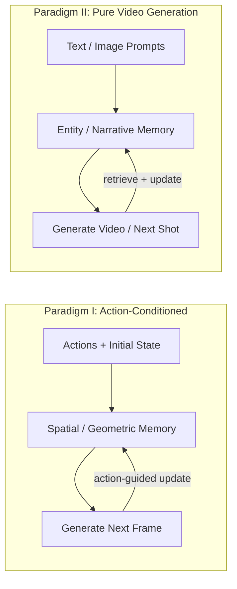
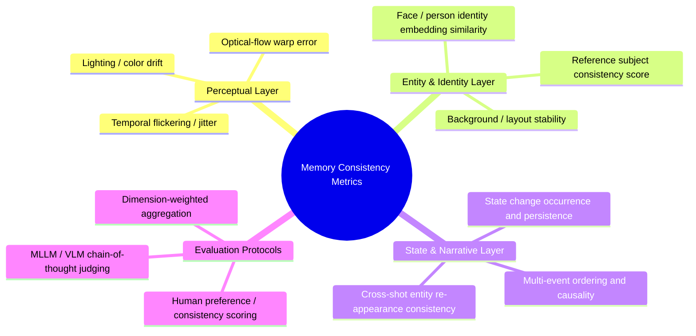

<div align="center">

# Awesome World Models with Memory

[](https://github.com/sindresorhus/awesome) [](LICENSE.txt) [](CONTRIBUTING.md)

**A Curated List of Memory-Augmented World Models for Video Generation, organized by two fundamental paradigms: Action-Conditioned Interactive World Models and Pure Video Generation with Narrative Memory.**

*Last Updated: 2026-03-05 | Papers: 40+ | Benchmarks: 12+*

</div>

---

## News & Updates

**[2026-03] Major Restructure: Two-Paradigm Organization** -- Papers are now organized into two distinct paradigms: (I) **Action-Conditioned Interactive World Models**, where actions provide strong constraints coupled with memory; and (II) **Pure Video Generation with Memory**, where models rely on genuine memory capacity and world understanding without action guidance. Video generation benchmarks significantly expanded based on a comprehensive literature survey (2021--2026).

**[2026-02] Repository Launch** -- Awesome World Models with Memory is now live! See [CONTRIBUTING.md](CONTRIBUTING.md) for how to contribute.

---

## Overview

> **Badge Legend:**
> [](#) Paper on arXiv
> [](#) Source code available
> [](#) Project page

- [Two Paradigms of Memory in World Models](#two-paradigms-of-memory-in-world-models)
- **Part I -- Action-Conditioned Interactive World Models**
  - [Geometric / Spatial Memory](#geometric--spatial-memory)
  - [External Memory + Retrieval](#external-memory--retrieval)
  - [Memory Compression (Action-Conditioned)](#memory-compression-action-conditioned)
  - [Recurrent / Hidden State Memory (Action-Conditioned)](#recurrent--hidden-state-memory-action-conditioned)
  - [Inference Efficiency](#inference-efficiency)
  - [Training Stability (Action-Conditioned)](#training-stability-action-conditioned)
  - [Open-source Interactive Systems](#open-source-interactive-systems)
  - [Benchmarks (Action-Conditioned)](#benchmarks-action-conditioned)
- **Part II -- Video Generation with Memory (Narrative & Multi-Shot)**
  - [External Memory + Entity-Level Retrieval](#external-memory--entity-level-retrieval)
  - [Memory Compression & Context Efficiency](#memory-compression--context-efficiency)
  - [Hierarchical / Keyframe Memory Anchors](#hierarchical--keyframe-memory-anchors)
  - [Streaming / Queue-based Long Video Generation](#streaming--queue-based-long-video-generation)
  - [Reference-Driven Cross-Shot Consistency](#reference-driven-cross-shot-consistency)
  - [Recurrent / Hidden State Memory (Video Generation)](#recurrent--hidden-state-memory-video-generation)
  - [Attention & Long-Context Extensions](#attention--long-context-extensions)
  - [Foundational & Pioneering Works](#foundational--pioneering-works)
  - [Benchmarks (Video Generation Consistency)](#benchmarks-video-generation-consistency)
- [Related World Model Lists](#related-world-model-lists)
- [Citation](#citation)

---

## Two Paradigms of Memory in World Models

Over the past two years, "world models with memory" have diverged into two fundamentally different paradigms. While both require memory to maintain long-term consistency, **the role of memory and the failure modes differ substantially**, making direct comparison between them misleading.

| | **Paradigm I: Action-Conditioned** | **Paradigm II: Pure Video Generation** |
|---|---|---|
| **Input** | Actions (keyboard, camera trajectory, joystick) + initial state | Text prompts / reference images / storyboards |
| **Memory's role** | Remember **WHERE** things are (spatial layout, geometry) under explicit control | Remember **WHAT** things are (entity identity, state, narrative) without action guidance |
| **Core coupling** | Actions provide strong structural constraints that tightly couple with memory | No action constraints -- memory alone must provide world understanding |
| **Dominant memory type** | Geometric / spatial (point clouds, surfels, 3D maps) | Entity-centric (identity slots, keyframe banks, compressed context) |
| **Key failure mode** | Revisit inconsistency, spatial drift under control | Entity drift, state forgetting, narrative incoherence across shots |
| **Evaluation focus** | Spatial consistency, revisit fidelity, action following | Entity persistence, state continuity, cross-shot coherence |



> **Why this distinction matters:** In Paradigm I, the action signal tells the model WHERE to go -- memory only needs to recall what's there. In Paradigm II, there is no such guidance -- memory must encode a holistic understanding of the world (who, what, where, and how things have changed) to maintain coherence. This makes the "pure memory" challenge qualitatively harder in some aspects, while the "spatial precision under control" challenge is harder in others. Mixing them in a single leaderboard conflates fundamentally different capabilities.

---

# Part I: Action-Conditioned Interactive World Models

*Models that take explicit action / camera inputs and generate next frames interactively. Memory here is tightly coupled with action signals to maintain spatial consistency and enable revisit fidelity.*

---

## Geometric / Spatial Memory

*Point cloud / surfel / local anchors and other 3D structures as spatial memory, solving revisit and camera control.*

- [**2026**] **AnchorWeave**, "AnchorWeave: World-Consistent Video Generation with Retrieved Local Spatial Memories". [](https://arxiv.org/abs/2602.14941) [](https://github.com/wz0919/AnchorWeave)
  > Replaces single global 3D memory with "multiple local geometric memories": coverage-driven retrieval of local spatial memories + multi-anchor weaving controller to fuse cross-viewpoint inconsistencies.

- [**2026**] **UCM**, "UCM: Unifying Camera Control and Memory with Time-aware Positional Encoding Warping for World Models". [](https://arxiv.org/abs/2602.22960) [](https://humanaigc.github.io/ucm-webpage/)
  > Uses full history frames as memory, but builds token-level explicit correspondence via "time-aware PE warp"; dual-stream DiT block-sparse attention reduces memory token cost. Reports camera control error (RotErr/TransErr) and consistency metrics (PSNR/SSIM/LPIPS).

- [**2025**] **Spatia**, "Spatia: Video Generation with Updatable Spatial Memory". [](https://arxiv.org/abs/2512.15716) [](https://zhaojingjing713.github.io/Spatia/)
  > Explicitly maintains a 3D scene point cloud as persistent spatial memory, continuously updated via visual SLAM; generation conditioned on this memory with dynamic/static decoupling.

- [**2025**] **Voyager**, "Voyager: Long-Range and World-Consistent Video Diffusion for Explorable 3D Scene Generation". [](https://arxiv.org/abs/2506.04225) [](https://github.com/Tencent-Hunyuan/HunyuanWorld-Voyager)
  > Simultaneously generates RGB+Depth and reconstructs point cloud sequences; world cache (with point culling) + autoregressive iterative expansion for long-path exploration consistency.

- [**2025**] **MagicWorld**, "MagicWorld: Interactive Geometry-driven Video World Exploration". [](https://arxiv.org/abs/2511.18886) [](https://vivocameraresearch.github.io/magicworld/)
  > Action-Guided 3D Geometry Module (AG3D) constructs point cloud to constrain viewpoint changes; History Cache Retrieval (HCR) retrieves history frames as conditions to mitigate multi-step interactive drift.

- [**2025**] **WorldPlay**, "WorldPlay: Towards Long-Term Geometric Consistency for Real-Time Interactive World Modeling". [](https://arxiv.org/abs/2512.14614)
  > Reconstituted Context Memory: rebuilds usable context while keeping key geometric frames accessible; Context Forcing distillation training to maintain memory utilization. Claims 720p@24FPS streaming with improved consistency.

---

## External Memory + Retrieval

*Frame-level or feature-level memory banks with retrieval, conditioned on camera/action overlap for interactive generation.*

- [**2025**] **Context as Memory**, "Context as Memory: Scene-Consistent Interactive Long Video Generation with Memory Retrieval". [](https://arxiv.org/abs/2506.03141) [](https://context-as-memory.github.io/)
  > Directly stores history frames as memory and concatenates at input dimension; Memory Retrieval uses camera FOV overlap to filter relevant frames, reducing computational explosion. Claims SOTA memory capability on interactive long video with open-domain generalization.

- [**2025**] **VMem**, "VMem: Surfel Memory of Views". [](https://arxiv.org/abs/2506.18903) [](https://github.com/runjiali-rl/vmem)
  > Surfel-indexed view memory, anchoring historical views to surface elements for improved long-term consistency.

- [**2025**] **WorldMem**, "WorldMem: Long-term Consistent World Simulation with Memory". [](https://arxiv.org/abs/2504.12369)
  > Explicitly targets "memory-augmented long-term world simulation consistency" for revisit tasks.

- [**2025**] **VRAG**, "Learning World Models for Interactive Video Generation". [](https://arxiv.org/abs/2505.21996)
  > Interactive video world model with "retrieval-augmented" approach (VRAG) and evaluation framework.

- [**2025**] **Video World Models with Long-term Spatial Memory**. [](https://arxiv.org/abs/2506.05284)
  > Focuses on "long-term spatial memory" in video world models for spatial consistency and revisit tasks.

---

## Memory Compression (Action-Conditioned)

*Compress infinite action-conditioned history into a fixed budget while preserving spatial consistency for interactive rollouts.*

- [**2026**] **Infinite-World**, "Infinite-World: Scaling Interactive World Models to 1000-Frame Horizons via Pose-Free Hierarchical Memory". [](https://arxiv.org/abs/2602.02393) [](https://rq-wu.github.io/projects/infinite-world/index.html) [](https://github.com/MeiGen-AI/Infinite-World)
  > Hierarchical Pose-free Memory Compressor (HPMC) recursively compresses history latents to a fixed budget; combined with uncertainty-aware action annotation and revisit-dense finetune to activate loop-closure. Open-source code + weights.

- [**2025**] **WorldPack**, "WorldPack: Compressed Memory Improves Spatial Consistency in Video World Modeling". [](https://arxiv.org/abs/2512.02473)
  > Compressed memory via trajectory packing + memory retrieval for long rollout spatial consistency. Significantly outperforms baselines on LoopNav benchmark.

---

## Recurrent / Hidden State Memory (Action-Conditioned)

*RNN/LSTM, SSM, recurrent states as persistent internal state for interactive world simulation.*

- [**2026**] **Flow Equivariant World Models**, "Flow Equivariant World Models: Memory for Partially Observed Dynamic Environments". [](https://arxiv.org/abs/2601.01075) [](https://flowequivariantworldmodels.github.io/)
  > Unifies ego-motion and object motion as Lie group flows, building equivariant latent memory map; maintains stable world state in partially observable environments.

- [**2025**] **RELIC**, "RELIC: Interactive Video World Model with Long-Horizon Memory". [](https://arxiv.org/abs/2512.04040) [](https://relic-worldmodel.github.io/)
  > Highly compressed history latent tokens (with relative actions and absolute camera poses) as long-term memory in KV cache; self-distillation/self-forcing converts bidirectional teacher to causal student. 14B model achieves 16 FPS with superior action-following and spatial memory retrieval.

- [**2025**] **Long-Context SSM Video World Models**, "Long-Context State-Space Video World Models". [](https://arxiv.org/abs/2505.20171) [](https://ryanpo.com/ssm_wm/)
  > Block-wise SSM scanning to extend temporal memory (reducing attention long-context cost), combined with local dense attention for consecutive frame consistency. Evaluated on Memory Maze and Minecraft.

---

## Inference Efficiency

*Attention acceleration and KV-cache optimization for long action-conditioned rollouts. These techniques are often cross-cutting and applicable to Part II as well.*

- [**2026**] **TempCache / AnnSA / AnnCA**, "Fast Autoregressive Video Diffusion and World Models with Temporal Cache Compression and Sparse Attention". [](https://arxiv.org/abs/2602.01801) [](https://dvirsamuel.github.io/fast-auto-regressive-video/)
  > Training-free attention acceleration: TempCache (KV-cache temporal merging) + AnnSA (self-attention ANN sparsification) + AnnCA (cross-attention per-frame prompt token filtering). Reports 5-10x end-to-end speedup while maintaining near-constant peak memory during long rollouts. *Also applicable to video generation (Part II).*

---

## Training Stability (Action-Conditioned)

*Aligning training-inference distribution, suppressing long-rollout error accumulation in interactive settings.*

- [**2026**] **LIVE**, "LIVE: Long-horizon Interactive Video World Modeling". [](https://arxiv.org/abs/2602.03747)
  > Cycle-consistency training: forward rollout followed by reverse generation to reconstruct initial state, using diffusion loss to constrain long-rollout error propagation; with progressive curriculum training. Claims SOTA on long-rollout benchmarks.

> [!NOTE]
> Several papers in other sections also contain significant training stability components:
> - **RELIC** (self-distillation / self-forcing from bidirectional teacher to causal student)
> - **WorldPlay** (Context Forcing distillation training)
> - **Infinite-World** (revisit-dense finetuning to activate loop-closure)

---

## Open-source Interactive Systems

*End-to-end open-source world model systems with long-term memory as an engineering capability.*

- [**2026**] **LingBot-World**, "Advancing Open-source World Models". [](https://arxiv.org/abs/2601.20540) [](https://github.com/robbyant/lingbot-world)
  > Open-source world simulator with minute-level temporal context consistency and real-time interactive capability. Claims 16 FPS with <1s latency. Public code and model downloads (HuggingFace / ModelScope).

---

## Benchmarks (Action-Conditioned)

*Evaluation frameworks specifically designed for memory consistency and action control in interactive world models.*

- [**2026**] **MIND**, "MIND: Benchmarking Memory Consistency and Action Control in World Models". [](https://arxiv.org/abs/2602.08025) [](https://github.com/CSU-JPG/MIND)
  > First open-domain closed-loop revisited benchmark, evaluating memory consistency and action control; provides MIND-World baseline. 250 videos at 1080p@24FPS, with first/third person and diverse action spaces. UE5-generated.

- [**2025**] **LoopNav**, "Toward Memory-Aided World Models: Benchmarking via Spatial Consistency". [](https://arxiv.org/abs/2505.22976)
  > Looped-trajectory Minecraft revisit dataset, specifically examining spatial consistency and memory module capability. ~250 hours, 20M frames. Open-sources dataset, benchmark, and code.

---

<p align="right"><a href="#awesome-world-models-with-memory">Back to Top</a></p>

---

# Part II: Video Generation with Memory (Narrative & Multi-Shot)

*Models that generate video from text/image prompts without explicit action inputs. Memory here must provide genuine world understanding -- maintaining entity identity, state persistence, and narrative coherence across long horizons and shot boundaries, without the crutch of action-guided spatial constraints.*

*The research trend (2021--2026) has moved from "short clip quality" to "long-horizon, cross-shot, multi-event narrative", exposing the core bottleneck: models' insufficient "memory capacity" for long-term context -- character identity, costume texture, prop appearance, background layout, and state changes (injury / damage / picked-up objects) drift or are forgotten across time and shot boundaries.*

### Memory Mechanism Taxonomy (Video Generation)

The mainstream memory designs for video generation can be grouped into four paradigms:

1. **External Memory Bank + Retrieval/Update**: Store history as frames / latents / tokens / entity slots in a memory bank; retrieve most relevant memories before generating new segments. For cross-event, cross-shot entity consistency and state persistence.
2. **Chunk/Streaming Memory Compression & Activation**: Tackle quadratic attention cost in long sequences by "activating only relevant memories" -- balancing consistency with efficiency.
3. **Keyframe / Hierarchical Generation as Global Memory Anchors**: Generate global keyframes or discrete tokens first, then locally complete -- reducing error accumulation and providing global constraints.
4. **Reference-Driven Consistency Attention**: Treat reference entities (characters / objects / styles) as long-term memory, using cross-frame / cross-shot alignment to preserve identity and appearance.

---

## External Memory + Entity-Level Retrieval

*Entity/shot/segment-level Memory Bank with on-demand retrieval and update, designed for narrative multi-shot consistency. The "purest" form of memory for video generation -- explicitly maintaining what entities look like and what states they're in.*

- [**2026**] **VideoMemory**, "VideoMemory: Toward Consistent Video Generation via Memory Integration". [](https://arxiv.org/abs/2601.03655) [](https://hit-perfect.github.io/VideoMemory/)
  > Entity-centric Dynamic Memory Bank with dedicated character/prop/background slots; shot-level "retrieve-update" combined with multi-agent script decomposition. DINOv2 similarity metrics show significantly better consistency across 4/8/12 shots. Also provides 54-case multi-shot consistency evaluation suite covering character/prop/background persistence.

- [**2026**] **Memory-V2V**, "Memory-V2V: Augmenting Video-to-Video Diffusion Models with Memory". [](https://arxiv.org/abs/2601.16296) [](https://dohunlee1.github.io/MemoryV2V/) [](https://github.com/DoHunLee1/Memory-V2V)
  > External cache memory for multi-round video editing: retrieval (VideoFOV overlap / source similarity) + dynamic tokenization + learnable token compressor. Adaptive token merging achieves >30% FLOPs and runtime reduction without quality degradation.

- [**2025**] **OneStory**, "OneStory: Coherent Multi-Shot Video Generation with Adaptive Memory". [](https://arxiv.org/abs/2512.07802) [](https://zhaochongan.github.io/projects/OneStory/)
  > Reformulates multi-shot generation as next-shot prediction; Frame Selection builds semantically-relevant global memory from history; Adaptive Conditioner does importance-guided patch compression and direct injection. Trained on 60K multi-shot dataset.

- [**2025**] **StoryMem**, "StoryMem: Memory-to-Video for Multi-Shot Story Generation". [](https://arxiv.org/abs/2512.19539)
  > Memory-to-Video (M2V) design: maintains a compact keyframe memory bank from historical shots; injects memory via latent concatenation and negative RoPE shift; only requires LoRA fine-tuning. Releases ST-Bench (30 story scripts, 300 fine-grained video prompts covering character/scene/event/shot type). Represents the "lightweight memory injection + prompt-set evaluation" engineering direction.

---

## Memory Compression & Context Efficiency

*Compress infinite history into fixed-budget representations; retrieve or activate only relevant memory for generation. Balancing long-term consistency with computational feasibility.*

- [**2025**] **MemFlow**, "MemFlow: Flowing Adaptive Memory for Consistent and Efficient Long Video Narratives". [](https://arxiv.org/abs/2512.14699) [](https://github.com/KlingTeam/MemFlow)
  > Reformulates long video generation as "internal in-context retrieval": Narrative Adaptive Memory retrieves and updates memory bank by current paragraph prompt; Sparse Memory Activation activates only the most relevant memory tokens in attention. ~7.9% speed overhead vs. memory-free baseline while significantly improving consistency.

- [**2025**] **Pack and Force Your Memory**, "Pack and Force Your Memory: Long-form and Consistent Video Generation". [](https://arxiv.org/abs/2510.01784)
  > MemoryPack: learnable context retrieval combining text and image global guidance for short/long dependencies; Direct Forcing: single-step approximation for training-inference alignment and error accumulation mitigation.

- [**2025**] **LoViC**, "LoViC: Efficient Long Video Generation with Context Compression". [](https://arxiv.org/abs/2507.12952)
  > FlexFormer: jointly compresses video and text into unified latent, supporting adjustable compression rates and long video segment-wise generation.

- [**2025**] **PFP**, "Pretraining Frame Preservation in Autoregressive Video Memory Compression". [](https://arxiv.org/abs/2512.23851)
  > Compresses long videos into short contexts (~5k tokens for 20s video) with pretraining objective to preserve high-frequency single-frame details at arbitrary temporal positions. Pretrained models fine-tunable as memory encoders for autoregressive video generation. By Lvmin Zhang (FramePack author) et al.

---

## Hierarchical / Keyframe Memory Anchors

*Generate global keyframes first as "memory anchors", then locally complete intermediate frames -- providing global consistency constraints and reducing error accumulation through hierarchical generation.*

- [**2025**] **TokensGen**, "TokensGen: Multi-Turn Token Generation for Long Video Generation". [](https://arxiv.org/abs/2507.15728)
  > Two-stage pipeline: T2To generates global compressed tokens as cross-clip consistency anchors; To2V generates video conditioned on these tokens. Adaptive FIFO connection at inference reduces boundary artifacts. Cited by 5.

- [**2023**] **NUWA-XL**, "NUWA-XL: Diffusion over Diffusion for eXtremely Long Video Generation". [](https://arxiv.org/abs/2303.12346)
  > "Diffusion over Diffusion" hierarchy: global diffusion generates keyframes spanning the entire timeline, local diffusion recursively completes intermediate frames. Directly trained on long video to reduce training-inference gap. Proposes FlintstonesHD benchmark. ACL 2023. Cited by 189.

---

## Streaming / Queue-based Long Video Generation

*Infinite-length video via streaming/queue-based inference, with memory as sliding context or recursive guidance. Core challenge: maintaining consistency despite the streaming constraint.*

- [**2025**] **Ouroboros-Diffusion**, "Ouroboros-Diffusion: Long Video Generation via Autoregressive Diffusion with Cross-Frame Alignment". [](https://arxiv.org/abs/2501.09019)
  > Enhances FIFO-Diffusion framework with SACFA (Subject-Aware Cross-Frame Alignment attention for subject consistency) and self-recurrent guidance (using queue-head history to guide queue-tail denoising). Reports improved subject/structural consistency on VBench. Cited by 4.

- [**2025**] **Presto**, "Presto: Progressive Pretraining Enhances Synthetic Data for Text-to-Video Generation". [](https://arxiv.org/abs/2412.01316)
  > Segmented Cross-Attention (SCA): splits hidden states by time segment and aligns each to its sub-caption for long-range semantic consistency. Builds LongTake-HD dataset (261k long-take videos with total caption + 5 progressive sub-captions). Cited by 8.

- [**2024**] **FIFO-Diffusion**, "FIFO-Diffusion: Generating Infinite Videos from Text without Training". [](https://arxiv.org/abs/2312.12480)
  > Diagonal denoising queue: head outputs frames, tail receives noise; constant VRAM for infinite-length generation. Introduces latent partitioning and lookahead denoising to reduce training-inference gap. The core challenge remains long-range consistency. NeurIPS 2024. Cited by 96.

---

## Reference-Driven Cross-Shot Consistency

*Use reference entities (characters, objects, styles) as "long-term memory anchors" via cross-frame/cross-shot alignment mechanisms to preserve identity and appearance. These approaches explicitly address the "identity vs. motion" conflict -- attention features encode both identity and motion, so naive sharing sacrifices one for the other.*

- [**2025**] **ShotAdapter**, "ShotAdapter: Multi-Shot Video Generation with Full Attention". [](https://arxiv.org/abs/2505.07652)
  > Builds multi-shot training data pipeline from single-shot data; lightweight fine-tuning of pretrained T2V for multi-shot video generation with shot control. CVPR 2025. Cited by 11.

- [**2024**] **StoryDiffusion**, "StoryDiffusion: Consistent Self-Attention for Long-Range Image and Video Generation". [](https://arxiv.org/abs/2405.01434)
  > Consistent Self-Attention: uses reference tokens to guide self-attention for cross-shot identity preservation; Semantic Motion Predictor converts image sequences to video while maintaining subject stability. NeurIPS 2024. Code available.

- [**2024**] **Video Storyboarding**, "Video Storyboarding: Training-Free Multi-Shot Video Generation via Feature Sharing". [](https://arxiv.org/abs/2412.07750)
  > Training-free cross-shot feature sharing and query injection for character consistency. Provides a mechanistic explanation of the "identity vs. motion" conflict: shared attention features simultaneously carry identity and motion information, so simple sharing sacrifices dynamics. Cited by 4.

- [**2023**] **VideoAssembler / MagDiff**, "VideoAssembler: Identity-Consistent Video Generation with Reference Entities using Diffusion Model". [](https://arxiv.org/abs/2311.17338)
  > Introduces reference entity alignment (subject-driven, prompt-adaptive) to reduce per-subject fine-tuning dependency and strengthen identity preservation across shots. Cited by 19.

---

## Recurrent / Hidden State Memory (Video Generation)

*RNN/LSTM, SSM, recurrent states as persistent memory for autoregressive video generation without actions.*

- [**2025**] **VideoSSM**, "VideoSSM: Autoregressive Long Video Generation with Hybrid State-Space Memory". [](https://arxiv.org/abs/2512.04519)
  > Hybrid memory: sliding-window local lossless cache (short memory) + SSM compressed global state (long memory). Treats generation as a recurrent dynamical system updating compressed states.

- [**2025**] **RAD**, "Recurrent Autoregressive Diffusion: Global Memory Meets Local Attention". [](https://arxiv.org/abs/2511.12940)
  > Introduces LSTM as global memory in diffusion transformer combined with local attention; training/inference-consistent frame-wise autoregression updates and retrieval.

---

## Attention & Long-Context Extensions

*Sparse attention, context packing, and routing mechanisms to make long video history usable without inference blowup.*

- [**2025**] **FramePack**, "Packing Input Frame Context in Next-Frame Prediction Models for Video Generation". [](https://arxiv.org/abs/2504.12626) [](https://github.com/lllyasviel/FramePack)
  > Frame context packing: compresses arbitrary number of frames into fixed-length context (independent of video length); anti-drifting sampling reduces exposure bias / error accumulation. Makes video diffusion training/inference bottleneck approach that of image diffusion. Widely adopted in practice.

- [**2025**] **MoGA**, "MoGA: Mixture-of-Groups Attention for End-to-End Long Video Generation". [](https://arxiv.org/abs/2510.18692)
  > Semantic routing of tokens to groups for sparse attention (MoE-style routing for attention), eliminating full-attention quadratic complexity. Generates minute-level 480p@24fps video with ~580k token context end-to-end.

---

## Foundational & Pioneering Works

*Earlier works that laid the foundation for memory-aware video generation, or that address long-context generation without explicitly framing it as "memory". Included for historical context and because their architectural insights remain influential.*

- [**2025**] **TTT-Video-DiT**, "One-Minute Video Generation with Test-Time Training". [](https://arxiv.org/abs/2504.05298) [](https://test-time-training.github.io/video-dit/) [](https://github.com/test-time-training/ttt-video-dit)
  > Inserts Test-Time Training (TTT) layers into a pretrained Transformer, whose hidden states are themselves neural networks (more expressive than SSM/Mamba). Enables one-minute video generation (300k+ tokens) from text storyboards. Leads baselines by 34 Elo points. CVPR 2025. *TTT layers function as a long-context sequence modeling layer rather than an explicit memory mechanism.*

- [**2023**] **Reuse and Diffuse**, "Reuse and Diffuse: Iterative Denoising for Text-to-Video Generation". [](https://arxiv.org/abs/2309.03549)
  > Iteratively generates more frames by reusing previous clip's intermediate latent features and mimicking the diffusion process; reduces temporal jitter and computational cost. Establishes "trajectory reuse as implicit memory" pattern. Cited by 64.

- [**2022/2023**] **Phenaki**, "Phenaki: Variable Length Video Generation From Open Domain Textual Description". [](https://arxiv.org/abs/2210.02399)
  > Video tokenizer with temporal causal attention for variable length; masked transformer generates video tokens from text, enabling story-style multi-prompt generation. Pioneered "narrative video from prompt sequences". ICLR 2023. Cited by 616.

- [**2022**] **Flexible Diffusion Modeling of Long Videos**. [](https://arxiv.org/abs/2205.11495)
  > At test time, can sample arbitrary frame subsets conditioned on any other frames -- treating "already-generated frames as selectively referenceable memory". Established "long-range conditional sampling schedule" paradigm with CARLA simulator data and semantic metrics. Cited by 386.

- [**2022**] **LVDM**, "Latent Video Diffusion Models for High-Fidelity Long Video Generation". [](https://arxiv.org/abs/2211.13221)
  > 3D latent diffusion with hierarchical generation for thousands of frames; conditional latent perturbation and unconditional guidance to suppress long-sequence degradation. More about "error accumulation suppression" than explicit memory, but directly serves long-video stability. Cited by 561.

> [!NOTE]
> Training stability is also critical for video generation. Relevant techniques include:
> - **Pack and Force Your Memory** (Direct Forcing for training-inference alignment)
> - **FramePack** (anti-drifting sampling to reduce exposure bias)
> - **Ouroboros-Diffusion** (self-recurrent guidance from history)

---

## Benchmarks (Video Generation Consistency)

> **Structural Gap:** Standardized, reproducible benchmarks for measuring cross-shot long-term memory consistency are still scarce. Many methods rely on proxy metrics (temporal flicker, tLPIPS, embedding similarity) or expensive human evaluation / MLLM scoring. The field needs benchmarks that explicitly test "does the model remember what happened earlier and maintain it later" -- especially for multi-shot narrative scenarios.

### Multi-Shot Narrative & Long-Term Consistency

*Benchmarks that explicitly target cross-shot entity persistence, state continuity, and narrative coherence.*

- [**2026**] **MSVBench**, "MSVBench: Benchmarking Multi-Shot Video Generation". [](https://arxiv.org/abs/2602.23969)
  > The most direct benchmark for multi-shot long-term consistency. Hierarchical data structure (global characters/environments, scenes, shots); hybrid evaluation combining expert models and MLLMs. Covers face/character/background/clothes&color/relative size consistency, and critically introduces **State Shift & Persistence** as a metric -- the closest metric to directly testing memory (e.g., does an injury persist? is a picked-up object still gone?). Spearman correlation with human evaluation: 94.4%. Current scale: 20 story reconstructions from ViStoryBench.

- [**2025**] **SeqBench**, "SeqBench: Evaluating Sequential Narrative Coherence in Text-to-Video Generation". [](https://arxiv.org/abs/2510.13042)
  > 320 prompts, 2,560 human-annotated videos (8 T2V models). Proposes Dynamic Temporal Graphs (DTG) as automatic metric to capture long-range dependency and event ordering. Tests "does the model remember what happened and in what order".

- [**2025**] **ST-Bench** (released with StoryMem). [](https://arxiv.org/abs/2512.19539)
  > 30 story scripts, 300 fine-grained prompts including shot types, camera movements, character/scene/event details. Released in StoryMem's official repository. Suited for "multi-shot prompt-driven consistency" experiments.

- [**2024/2025**] **TC-Bench**, "TC-Bench: Benchmarking Temporal Compositionality in Text-to-Video Generation". [](https://arxiv.org/abs/2406.08656)
  > Prompts describe explicit initial and final states to test whether temporal composition changes are completed correctly. Functions as a "state change memory test" -- did the model remember and execute the transition? Provides ground-truth videos and transition completion metrics. Most models fail at multi-stage state changes.

- [**2023**] **StoryBench**, "StoryBench: A Multifaceted Benchmark for Continuous Story Visualization". [](https://arxiv.org/abs/2308.11606)
  > Continuous story visualization across action execution / story continuation / story generation tasks. "Given previous video as condition" inherently tests whether memory/history is correctly inherited. NeurIPS 2023. Official implementation available.

- [**2026**] **VideoMemory 54-case**, "Multi-Shot Entity Consistency Evaluation Suite" (released with VideoMemory). [](https://arxiv.org/abs/2601.03655)
  > 54 test cases covering character/prop/background persistence scenarios. Small but directly targets entity-level cross-shot consistency. More hypothesis-driven than ecological, but closest to testing specific memory failure modes.

### Single-Shot Quality & Consistency Dimensions

*Comprehensive evaluation suites that decompose video quality into fine-grained dimensions, including consistency-related ones. Useful as baselines and for single-shot generation quality assessment.*

- [**2024**] **VBench**, "VBench: Comprehensive Benchmark Suite for Video Generative Models". [](https://arxiv.org/abs/2311.17982)
  > 16 hierarchical dimensions including subject consistency, background consistency, temporal flickering, motion smoothness. Prompt suite + evaluation pipeline + normalized scoring with quality/semantic weighting. De facto standard for single-shot video generation evaluation. CVPR 2024. Open-source.

- [**2025**] **VBench-2.0**, "VBench-2.0: Advancing Video Generation Benchmark Suite for Intrinsic Faithfulness". [](https://arxiv.org/abs/2503.21755)
  > Extends VBench beyond surface fidelity to "intrinsic faithfulness": human fidelity, controllability, creativity, physics, and commonsense. Combined VLM/LLM + expert model evaluation. Signals the trend from "visual artifacts" toward "world consistency / commonsense consistency". PyPI package available.

- [**2024**] **EvalCrafter**, "EvalCrafter: Benchmarking and Evaluating Large Video Generation Models". [](https://arxiv.org/abs/2310.11440)
  > ~700 prompts, 17 objective metrics + subjective alignment. Comprehensive evaluation toolkit for T2V models including temporal consistency related metrics. CVPR 2024. Open-source.

- [**2025**] **Video-Bench**, "Video-Bench: Human-Aligned Video Generation Benchmark". [](https://arxiv.org/abs/2504.04907)
  > 419 prompts (~70-90 per dimension), human annotations + MLLM evaluation protocol. Covers temporal consistency, motion quality, video-text consistency. Recommends 3x sampling per prompt to reduce random variance -- an important reproducibility guideline.

### Subject / Identity Consistency

*Benchmarks specifically targeting reference-entity preservation -- the "identity memory" dimension.*

- [**2025**] **OpenS2V-Eval / OpenS2V-5M** (OpenS2V-Nexus), "OpenS2V-Nexus: Subject-to-Video Generation". [](https://arxiv.org/abs/2505.20292)
  > OpenS2V-Eval: 180 prompts across 7 S2V scenarios; NexusScore / NaturalScore / GmeScore separately measure subject consistency, naturalness, and text relevance. OpenS2V-5M: 5M 720P subject-text-video triplets for training. Most sensitive benchmark for "reference subject as memory anchor" tasks.

- [**2025**] **PortraitGala** (EchoShot), "Large-Scale Portrait Video Dataset for Cross-Shot Identity Consistency". [](https://arxiv.org/abs/2506.15838)
  > 600k clips, 400k identities, ~1k hours. Fine-grained portrait attribute/clothing/action captions. More of a "trainable consistency data asset" than pure evaluation, but enables large-scale cross-shot identity consistency research.

### Physical & Temporal Compositionality

*Benchmarks testing whether generated videos obey physical laws and temporal logic -- complementary to memory consistency (consistent world state evolution requires remembering physics).*

- [**2025**] **T2VPhysBench**, "T2VPhysBench: Benchmarking Physics Consistency in Text-to-Video Generation". [](https://arxiv.org/abs/2505.00337)
  > Systematically tests T2V compliance with 12 basic physical laws using human evaluation protocol. Average compliance below 0.60 across all tested models. While not directly testing "memory", physical consistency requires persistent world-state awareness and causal coherence -- a complementary evaluation axis to entity memory.

### Datasets

- [**2025**] **LongTake-HD** (released with Presto). 261k long-take videos with total caption + 5 progressive sub-captions. Designed for long-range coherence; often evaluated with VBench. [](https://arxiv.org/abs/2412.01316) [](https://github.com/Cakeyan/Presto)
- [**2025**] **ViStoryBench**. 80 story segments, 344 characters, 509 reference images. Upstream asset for constructing multi-shot evaluation materials; provides download scripts and toolchain. [](https://github.com/ViStoryBench/vistorybench)
- [**2025**] **FlintstonesHD** (released with NUWA-XL). Long video generation benchmark based on The Flintstones. Details in paper. [](https://arxiv.org/abs/2303.12346)

### Evaluation Metrics Landscape

The metrics used across the above benchmarks can be organized into three layers:



> [!NOTE]
> **Reproducibility guidance for memory consistency experiments:**
> - Same prompt should be sampled **multiple times** with mean/variance reported (Video-Bench recommends 3x)
> - Long video / chunked methods should fix and report chunk length, overlap strategy, boundary transition strategy
> - Identity / subject consistency evaluation should use public benchmarks (OpenS2V-Eval, PortraitGala) or explicit reference assets (ViStoryBench / MSVBench reference images) to avoid text-only ambiguity

---

<p align="right"><a href="#awesome-world-models-with-memory">Back to Top</a></p>

## Related World Model Lists

This repository is inspired by the following awesome lists on world models. Their efforts in curating broad world model research motivated me to create a focused collection specifically on memory mechanisms.

- [Awesome-World-Models](https://github.com/knightnemo/Awesome-World-Models) - A comprehensive curated list spanning Embodied AI, Autonomous Driving, NLP and more
- [Awesome-World-Model](https://github.com/LMD0311/Awesome-World-Model) - World models for autonomous driving
- [Awesome-World-Models (Robotics)](https://github.com/leofan90/Awesome-World-Models) - World models for robotics

---

## Citation

If you find this repository useful, please consider citing:

```bibtex
@misc{awesome-world-models-with-memory,
  title={Awesome World Models with Memory},
  year={2026},
  howpublished={\url{https://github.com/SiriYep/Awesome-World-Models-with-Memory}},
  note={A curated list of memory-augmented world models for video generation}
}
```
